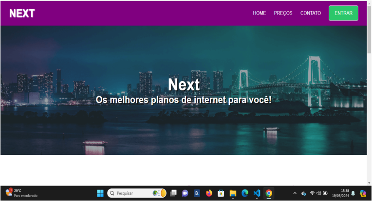

# Sobre o Projeto

Este projeto simula uma página de uma empresa fictícia que oferece serviços de provedores de internet chamada NEXT. A Página foi desenvolvida utilizando HTML, CSS e Javascript, possuindo também um arquivo responsivo para se adaptar a dispositivos mobile.

## Objetivo

O objetivo deste projeto é criar uma página que simula uma empresa que oferece planos de internet, o projeto foi desenvolvido para praticar e aprimorar habilidades em HTML, CSS, JavaScript e design responsivo.Desenvolvido como parte de um curso para aprender habilidades Front-End.

## Tecnologias Utilizadas

- HTML5

- CSS3

- JavaScript

## Ferramentas De Desenvolvimento

- Visual Studio Code

- Git

- GitHub

## Instalação 

1. **Clone o repositório:**

2. **Abra o projeto no seu editor de código:**

3. **Abra o arquivo `index.html` em um navegador web:**

## Contato

- E-mail: matheus.c.miola@outlook.com

- LinkedIn: https://www.linkedin.com/in/matheus-calegari-miola-4226a1228/

- GitHub: https://github.com/Matheus-Calegari-Miola

## Futuras Melhorias

Haverão melhorias e expansão desse projeto em um futuro próximo.

## Autor

Matheus Calegari Miola